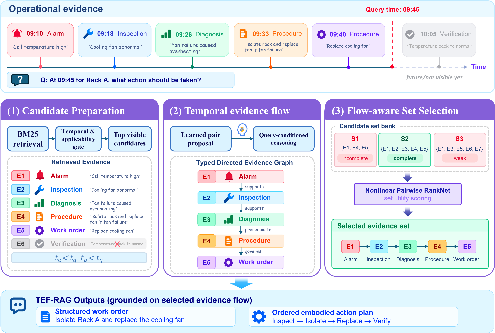
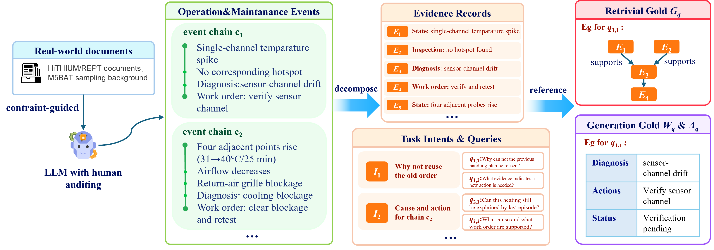

# TEF-RAG: Temporal Evidence Flow Retrieval-Augmented Generation

**Time-aware, relation-aware evidence-set retrieval for dynamic operation & maintenance knowledge.**

[**English**](README.md) | [**中文**](README.zh-CN.md)

  

## Overview

TEF-RAG is designed for retrieval-augmented generation in dynamic operation and maintenance (O&M) settings where relevant evidence is not enough by itself. A useful retrieval context must also respect **what was available at the query time** and assemble records that jointly support the operational process from observation and diagnosis to action and verification.

Instead of ranking records independently, TEF-RAG builds a **query-conditioned Temporal Evidence Flow** and ranks **evidence sets** with a nonlinear pairwise ranker.

| Temporal visibility | Evidence-flow reasoning | Set-level selection |
| --- | --- | --- |
| Filters evidence by event time, availability time, asset scope, and procedure applicability. | Proposes candidate evidence pairs and infers typed directed relations such as support, update, qualification, supersession, and verification. | Scores candidate evidence sets for complementary roles, relation consistency, and process completeness. |

## Paper

**TEF-RAG: Temporal Evidence Flow Retrieval-Augmented Generation**  
Juxian Yin

[📄 Read the paper](paper/TEF-RAG.pdf)

The repository publishes the compiled paper PDF rather than the LaTeX source.

## Benchmark

  

| Statistic | Count |
| --- | ---: |
| O&M event chains | 400 |
| Evidence records | 3,888 |
| Task intents | 1,200 |
| Queries | 2,400 |
| Target assets | 100 |

The benchmark is **public-source-grounded and AI-assisted synthetic data**. Public documents and research datasets constrain the equipment and sampling background; the event chains, maintenance scenarios, and task formulations are constructed for controlled evaluation and should not be interpreted as real station failure-frequency statistics.

## Results

### Retrieval

| Method | Recall@5 | nDCG@5 | Complete@5 | FlowComplete@5 |
| --- | ---: | ---: | ---: | ---: |
| BM25 | 0.3791 | 0.3915 | 0.0563 | 0.0563 |
| BGE Reranker | 0.2916 | 0.3070 | 0.0417 | 0.0417 |
| Fine-tuned BGE | 0.6650 | **0.6501** | 0.2854 | 0.2833 |
| Temporal-BM25 | 0.4591 | 0.4955 | 0.0792 | 0.0792 |
| TA-RAG | 0.2769 | 0.2907 | 0.0375 | 0.0375 |
| **TEF-RAG** | **0.7228** | 0.6231 | **0.3188** | **0.3146** |

### Structured generation

| Method | Field F1 | Action F1 | Citation F1 | Evidence Support Recall |
| --- | ---: | ---: | ---: | ---: |
| BM25 | 0.4715 | 0.1372 | 0.0813 | 0.1258 |
| BGE Reranker | 0.4129 | 0.1198 | 0.0405 | 0.0614 |
| Fine-tuned BGE | 0.4818 | 0.1910 | 0.0954 | 0.1328 |
| Temporal-BM25 | 0.5218 | 0.1637 | 0.1249 | 0.1871 |
| TA-RAG | 0.4059 | 0.1115 | 0.0379 | 0.0570 |
| **TEF-RAG** | **0.5345** | **0.2035** | **0.1585** | **0.2253** |

Machine-readable aggregate results are available in [results/](results/).

## Quick start

~~~bash
git clone https://github.com/joceah/TEF-RAG.git
cd TEF-RAG

python -m venv .venv
source .venv/bin/activate  # Linux/macOS
# .venv\Scripts\activate  # Windows
python -m pip install -e .
~~~

Validate and reproduce the published retrieval metrics without external model calls:

~~~bash
python -m scripts.validate_public_retrieval
python -m scripts.evaluate_public_retrieval
~~~

The task-adapted BGE training code is also included. It requires a local snapshot of `BAAI/bge-reranker-v2-m3`:

~~~bash
python -m scripts.run_fine_tuned_bge train --model-path /path/to/bge-reranker-v2-m3
python -m scripts.run_fine_tuned_bge test --model-path /path/to/bge-reranker-v2-m3
~~~

Validate the structured-generation benchmark or score your own predictions:

~~~bash
python -m scripts.validate_public_generation
python -m scripts.evaluate_public_generation --predictions /path/to/predictions
~~~

## Repository structure

~~~text
TEF-RAG/
├── assets/              # Architecture and benchmark figures
├── data/
│   ├── retrieval/       # Retrieval benchmark and published predictions
│   └── generation/      # Structured-generation references and schema
├── models/              # Learned pair-proposal and set-ranking artifacts
├── paper/
│   └── TEF-RAG.pdf      # Paper
├── results/             # Aggregate reference metrics
├── scripts/             # Validation, evaluation, and baseline training entry points
├── tests/               # Lightweight regression tests
└── tef_rag/             # Core implementation
~~~

## Data and reproducibility

The released test evaluator and predictions include the Fine-tuned BGE baseline, so the retrieval table above can be reproduced locally without external model calls. Fine-tuned BGE training code and its aggregate downstream-generation result are included; large intermediate adapter checkpoints and API caches are not committed.

## Citation

~~~bibtex
@misc{yin2026tefrag,
  title  = {TEF-RAG: Temporal Evidence Flow Retrieval-Augmented Generation},
  author = {Yin, Juxian},
  year   = {2026},
  url    = {https://github.com/joceah/TEF-RAG}
}
~~~
